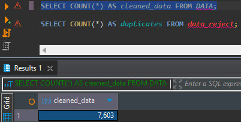
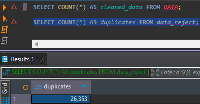

# CSV Data Cleansing - Technical Test Solution

## Script Explanation

This solution handles CSV data cleaning with duplicate removal and database storage. The main script processes music data from `source/scrap.csv`, removes duplicates based on unique IDs, and outputs clean data to JSON format while saving duplicates to CSV.

**Test 1**: Core data processing with database integration
**Test 2**: Dockerized version for deployment

The script keeps the latest record for each unique ID, converts data types properly, and stores everything in DuckDB tables.

## How to Run

### Docker
```bash
docker-compose up --build
```

### Python
```bash
pip install -r requirements.txt
python main.py
```

Make sure you have `scrap.csv` in the `source/` folder before running.

## Testing and Expected Results

### Output Files
- `target/data_YYYYMMDDHHMMSS.json` - Clean records in specified JSON format
- `target/data_reject_YYYYMMDDHHMMSS.csv` - Duplicate records

### Database Tables
After running, you'll get two tables in `music.duckdb`:

**'Data' Table Row Count:**



**'Data_Reject' Table Row Count:**



### Console Output


## Data Processing Details

The script handles:
- Date conversion from `dd/mm/yyyy` to `yyyy-mm-dd`
- Names converted to uppercase
- Comma-separated genres and track IDs become arrays
- Year extraction from release dates
- Proper data type mapping for database storage

## Improvements Made

1. **Error Handling**: Added try-catch for date parsing and file operations
2. **Docker Integration**: Complete containerization with volume mounting

## Project Structure
```
├── main.py
├── ddl.sql
├── docker-compose.yaml
├── Dockerfile
├── requirements.txt
├── source/scrap.csv
└── target/ (generated files)
```

## Technical Notes

- Used DuckDB for easy deployment without server setup
- Volume mounts keep source read-only, target writable
- Single timestamp ensures file naming consistency
- Duplicate detection keeps most recent records by date

Both Test 1 and Test 2 requirements completed successfully.
